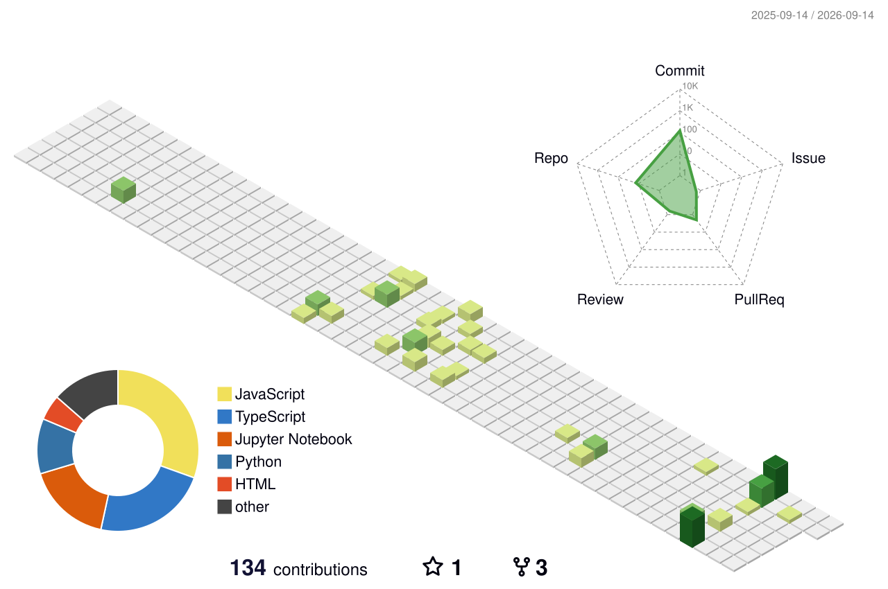

<!-- ═══════════════════════════════════════════════════════════════════════════
     ⚡ AKSHAT SHARMA — GitHub Profile
     ═══════════════════════════════════════════════════════════════════════════ -->

<div align="center">
  
</div>

<br/>

<div align="center">
  <a href="https://git.io/typing-svg">
    
  </a>
</div>

Hi, I'm **Akshat Sharma**, an AI & ML Engineer specializing in Generative AI, building LLM-powered applications, and scalable backend architectures.

<div>
  
  &nbsp;
  <a href="https://github.com/akshatsharma-x?tab=followers">
    
  </a>
</div>

<br/>

```js
// akshat_sharma.js — who am I?

const akshatsharma = {
    pronouns:    "he" | "him",
    title:       "Software Engineer",
    location:    "India",
    currentWork: "Building GenAI applications and scalable systems",
    learning:    ["Generative AI (RAG, LLMs)", "System Design", "Cloud Architectures"],
    askMeAbout:  ["Python", "Java", "Next.js", "Django", "FastAPI", "GenAI"],
    funFact:     "I debug in production and call it 'live testing'"
};
```

<br/>

## ⚙️ Tech Arsenal

**Languages & Runtimes:**<br/>


**Frameworks & Backend:**<br/>


**DevOps & Cloud:**<br/>


**Tools & Platforms:**<br/>


<br/>

## 📊 GitHub Analytics

<div align="center">
  
</div>

<br/>

<div align="center">
  
  
</div>

<br/>

## 📈 Contribution Activity

<div align="center">
  
</div>

<br/>

<div align="center">
  
</div>

<br/>

<div align="center">
  
  &nbsp;·&nbsp;
  
</div>

<br/>

## 🌐 Connect With Me

<div align="center">
  <a href="https://github.com/akshatsharma-x">
    
  </a>
  &nbsp;
  <a href="https://linkedin.com/in/">
    
  </a>
  &nbsp;
  <a href="mailto:">
    
  </a>
</div>

<br/>

<div align="center">
  
</div>

<br/>

---

<div align="center">
  <sub>PROFILE GENERATED & MAINTAINED BY <a href="https://github.com/akshatsharma-x">@AKSHATSHARMA-X</a></sub>
</div>
