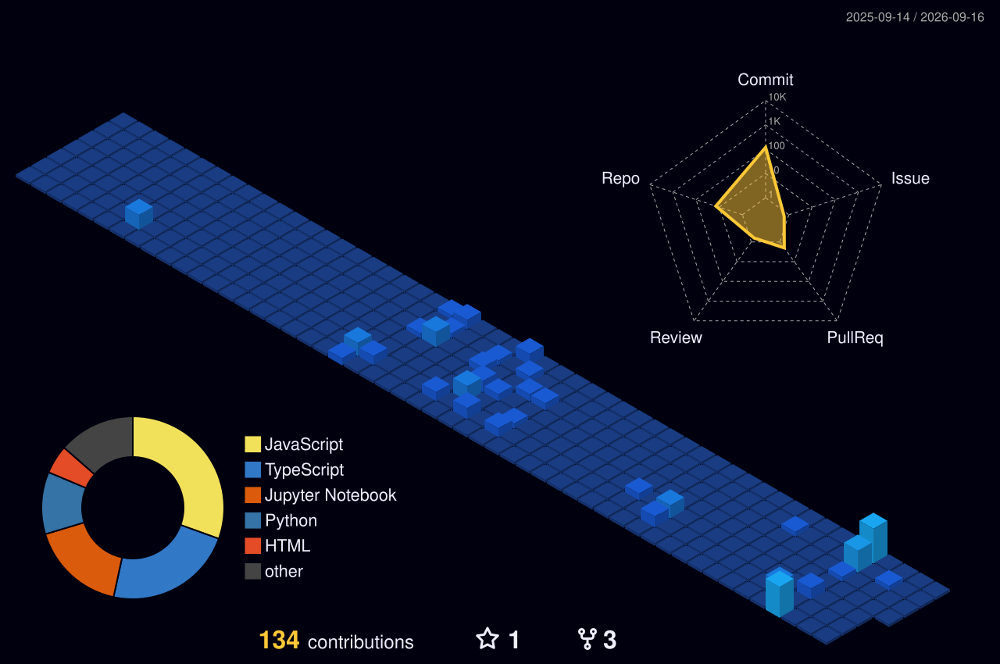

  

  

 

  

 

---

### About Me

  
  

    <strong>I'm a software developer with a passion for building robust, scalable applications and exploring bleeding-edge technologies.</strong>  
    I’m currently working on <strong>exciting new projects</strong>. 
    I'm currently learning <strong>System Design & Advanced Cloud Architecture</strong>. 
    I’m looking to collaborate on <strong>open source and innovative tech</strong>. 
    Ask me about <strong>Go, Rust, Microservices, and DevOps</strong>. 
    Fun fact: <strong>I love turning coffee into code!</strong>
  

 

---

### Tech Stack & Tools

  

 

---

### GitHub Analytics

  

 

  
  

 

---

### 🤖 Contribution Factory

  
  

  

